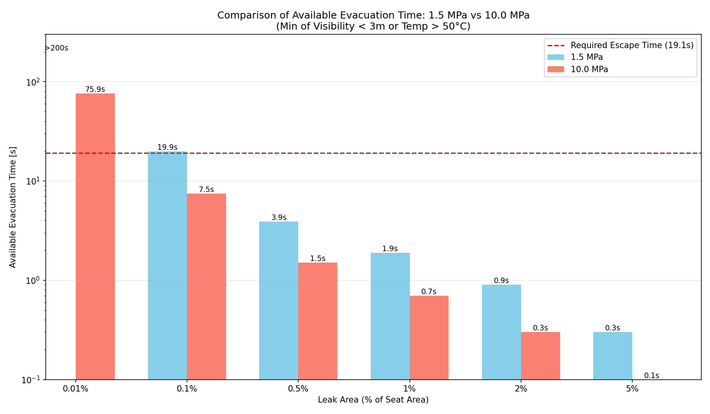

# 高エネルギー熱水系におけるシングルブロック（SBB）隔離のリスク評価

## 1. 概要
本プロジェクトは、190℃の高エネルギー熱水系統において、単一弁隔離（Single Block and Bleed: SBB）状態で系統開放作業を行う際のリスクを、物理シミュレーションに基づいて評価したものです。
特に、弁座リーク（シートリーク）が発生した際の「作業員の避難可能時間」および「直接的な熱傷リスク」を定量的に分析しています。

## 2. 評価条件
- **対象設備**: 600A ゲート弁（全開面積 約 0.28 m²）
- **流体条件**: 190℃ 熱水（フラッシング蒸発率 約 17%）
- **圧力条件**: 1.5 MPa および 10.0 MPa
- **作業環境**: 10m x 10m x 4m の室内（換気回数 0.5回/h）
- **評価基準（生存限界）**:
  - **温度**: 室温 50℃ 到達
  - **視程**: 蒸気充満による視認距離 3.0m 以下
  - **必要避難時間**: **19.1秒**（認知 2s + 判断 3s + 移動 14.1s）

## 3. 主要な知見

### 3.1 圧力によるリスクの激甚化
1.5 MPa と 10.0 MPa の比較により、圧力上昇が避難猶予時間を劇的に短縮させることが確認されました。

- **10.0 MPa 環境**: わずか **0.1%** の微小リークでも避難可能時間は **7.6秒** となり、必要時間（19.1秒）を確保できません。
- **1.5 MPa 環境**: 0.1% のリークでは 20.0秒の猶予がありますが、**0.5%** のリークで **4.0秒** まで低下し、生存が極めて困難になります。

### 3.2 視界喪失の即時性
熱水が漏洩すると、フラッシングにより瞬時に大量の蒸気が発生します。
- リーク面積 0.5% 以上の場合、**1.6秒〜4.0秒以内**に視界が奪われます。
- 視界不良下では移動速度が著しく低下し、実際の避難はシミュレーション以上に困難になります。

### 3.3 直接被曝による致命的熱傷
弁の近傍（1m以内）で作業中にリークが発生した場合、噴流の運動量により回避行動をとる間もなく重度熱傷（III度）を負うことが示されました。

## 4. シミュレーション結果の詳細

### 低圧ケース (1.5 MPa)

- リーク面積 0.5%（約 1414 mm²）以上で安全な退避は不可能。

### 高圧ケース (10.0 MPa)

- リーク面積 0.1%（約 283 mm²）の段階で既に退避不能。高圧系統の圧倒的な危険性が示されています。

## 5. 結論と提言
本評価の結果、高エネルギー熱水系における SBB 隔離（単一弁隔離）は、**作業員の生命を保護するには不十分である**と結論付けられます。

### 推奨される安全対策
1. **ダブルブロック＆ブリード（DBB）の義務化**: 系統開放時には、二重弁による隔離と、中間ドレン弁の開放による圧力抜き・漏洩検知を必須とする。
2. **隔離の信頼性確認**: 開放作業前にドレン弁から流体が出続けていないことを確実に確認する。
3. **安全距離の確保**: 弁操作中や初期開放時には、作業員を想定される噴流の到達範囲外に配置する。

---
## 構成ファイル
- `REPORT_SBB_Risk_Assessment_JP.md`: 詳細なリスク評価報告書（日本語）
- `valve_leak_simulation.py`: 1.5 MPa 条件のシミュレーションコード
- `valve_leak_simulation_10MPa.py`: 10.0 MPa 条件のシミュレーションコード
- `compare_pressures.py`: 圧力比較グラフ生成コード
- `requirements.txt`: 実行に必要なPythonライブラリ（numpy, matplotlib）
