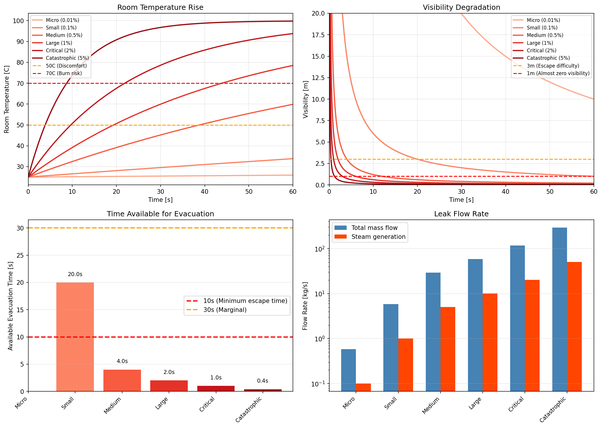
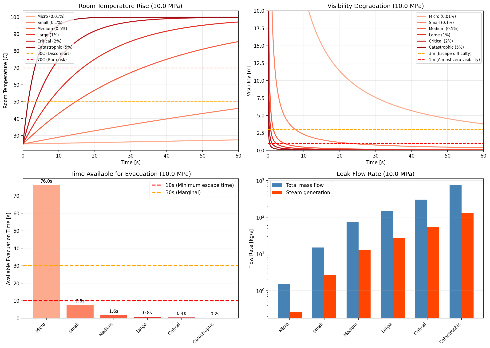

# 単一弁隔離（SBB）リスク評価レポート

## 高エネルギー熱水系統：600Aゲート弁シートリーク影響解析

---

## 1. 要約

本レポートは、高エネルギー熱水系統における単一弁隔離（Single Block and Bleed: SBB）手順のリスクを定量的に評価したものである。数値シミュレーションにより、典型的な運転条件（1.5 MPa および 10 MPa、190℃）における600Aゲート弁のシートリークは、数秒以内に危険な環境を形成し、作業員の安全な待避を極めて困難または不可能にすることを示した。

**主要結論：** 高エネルギー系統の開放作業におけるSBB隔離は、作業員の安全に対して許容できないリスクをもたらす。ダブルブロック＆ブリード（DBB）手順を必須とすべきである。

---

## 2. 背景と目的

### 2.1 目的

高エネルギー熱水系統における開放作業（フランジ切離し、機器分解等）時に、単一弁隔離に依存することのリスクを定量的に示す。

### 2.2 問題意識

単一の隔離弁に依存する場合、シートリークが発生すると高温高圧の熱水が作業エリアに直接放出される。本検討では、軽微なシートリークでも作業員の待避時間が確保できないことを明らかにする。

### 2.3 検討範囲

- **弁：** 600A（DN600）ゲート弁
- **流体：** 190℃熱水
- **圧力条件：** 1.5 MPa および 10 MPa
- **作業環境：** 密閉室内 10m × 10m × 4m（400 m³）

---

## 3. シミュレーション手法

### 3.1 物理モデル

本シミュレーションでは、オーダー推定に適した簡易的かつ物理的に妥当なモデルを採用した。

#### 3.1.1 リーク流量計算

シートリークを通過する流れは、臨界流（チョーク流れ）を考慮したオリフィス式でモデル化：

```
P₂/P₁ < 0.577（臨界流）の場合：
    ΔP = P₁ - P₁ × 0.577

流速： v = Cd × √(2ΔP/ρ)
質量流量： ṁ = ρ × A_leak × v

ここで：
    Cd = 0.62（流量係数）
    ρ = 876 kg/m³（190℃における水の密度）
```

#### 3.1.2 フラッシング蒸発

190℃の熱水が大気圧に開放されると、一部が瞬時に蒸発（フラッシング）する：

```
フラッシング率： x = (h_inlet - h_sat,liquid) / h_fg

190℃ → 大気圧の場合：
    h_inlet ≈ 807-815 kJ/kg
    h_sat,liquid = 419 kJ/kg（1気圧）
    h_fg = 2,257 kJ/kg

結果： x ≈ 17.2-17.5%
```

これは、リークした熱水の約17%が瞬時に蒸気になることを意味する。

#### 3.1.3 室内大気モデル

室内条件の時間変化は完全混合（CSTR）モデルで計算：

- 最小限の換気（0.5回/時）を考慮した蒸気蓄積
- 蒸気からの入熱による温度上昇
- 蒸気濃度に基づく視程低下

視程の相関式（経験式）：
```
視程 [m] = 0.15 / 蒸気濃度 [kg/m³]
```

### 3.2 仮定と制約

| パラメータ | 仮定 | 根拠 |
|-----------|------|------|
| 室内混合 | 瞬時・均一 | 平均条件に対して保守的 |
| 換気 | 0.5回/時 | 密閉機器室の典型値 |
| 初期条件 | 25℃、良好な視界 | 標準作業条件 |
| 流量係数 | 0.62 | シャープエッジオリフィスの標準値 |

**注記：** 本簡易モデルでは以下を考慮していない：
- 乱流噴流の混合詳細
- 空間的な温度勾配
- 作業員とリーク位置の関係
- 保護具の効果

これらの省略は、オーダー推定のリスク評価としては許容される。

---

## 4. リーク面積ケース設定と妥当性

### 4.1 検討ケース

| ケース | リーク面積（弁座比） | リーク面積（mm²） | 物理的状態 |
|--------|---------------------|------------------|-----------|
| 微小（Micro） | 0.01% | 28 | ヘアクラック、軽微な傷 |
| 小（Small） | 0.1% | 283 | 軽度のシート損傷、異物 |
| 中（Medium） | 0.5% | 1,414 | 中程度のシート侵食・腐食 |
| 大（Large） | 1% | 2,827 | 重度のシート損傷 |
| 重大（Critical） | 2% | 5,655 | 大規模シート破損 |
| 壊滅的（Catastrophic） | 5% | 14,137 | シート脱落・破壊 |

### 4.2 リーク面積設定の妥当性

本ケース設定は、業界経験および文書化された事例に基づく。

#### 4.2.1 業界基準との整合

- **API 598**（弁の検査・試験）：600A弁で許容されるシートリーク率は、弁座面積の約0.01-0.1%に相当
- **MSS SP-61**：ゲート弁について同様の許容リーク率を規定

#### 4.2.2 現場経験

| 状態 | 典型的リーク範囲 | 出典 |
|------|-----------------|------|
| 新品弁、適切に着座 | <0.01% | メーカー仕様 |
| 供用中の弁、通常摩耗 | 0.01-0.1% | プラント保全記録 |
| 異物噛み込み損傷 | 0.1-1% | インシデント報告 |
| 侵食・腐食のある弁 | 0.5-2% | 検査所見 |
| 損傷・破損シート | 1-5%以上 | 故障解析報告 |

#### 4.2.3 実際の事例

実際のインシデントで以下が確認されている：

1. **異物損傷：** 弁座に挟まった異物により、弁座面積の0.5-2%のリーク経路が形成
2. **熱サイクル：** 繰り返しの熱サイクルによるシート変形（特に大口径弁で顕著）
3. **侵食：** 部分開状態での高速流によるシートの進行性侵食
4. **腐食：** 水質異常時に特に発生

**中（0.5%）〜大（1%）ケースは、プラント寿命中に発生が予想される現実的なシナリオである。**

---

## 5. シミュレーション結果

### 5.1 ケース1：1.5 MPa / 190℃

| ケース | 質量流量 (kg/s) | 蒸気発生量 (kg/s) | 視程3m未満到達時間 | 待避評価 |
|--------|----------------|------------------|-------------------|---------|
| 微小 (0.01%) | 0.6 | 0.1 | >120秒 | 可能 |
| 小 (0.1%) | 5.8 | 1.0 | 20.0秒 | 極めて困難 |
| 中 (0.5%) | 29.2 | 5.0 | 4.0秒 | **不可能** |
| 大 (1%) | 58.5 | 10.1 | 2.0秒 | **不可能** |
| 重大 (2%) | 116.9 | 20.1 | 1.0秒 | **不可能** |
| 壊滅的 (5%) | 292.2 | 50.2 | 0.4秒 | **不可能** |

**噴出速度：** 23.6 m/s

### 5.2 ケース2：10 MPa / 190℃

| ケース | 質量流量 (kg/s) | 蒸気発生量 (kg/s) | 視程3m未満到達時間 | 待避評価 |
|--------|----------------|------------------|-------------------|---------|
| 微小 (0.01%) | 1.5 | 0.3 | 76.0秒 | 可能 |
| 小 (0.1%) | 15.1 | 2.7 | 7.6秒 | 極めて困難 |
| 中 (0.5%) | 75.5 | 13.2 | 1.6秒 | **不可能** |
| 大 (1%) | 150.9 | 26.5 | 0.8秒 | **不可能** |
| 重大 (2%) | 301.8 | 53.0 | 0.4秒 | **不可能** |
| 壊滅的 (5%) | 754.6 | 132.4 | 0.2秒 | **不可能** |

**噴出速度：** 60.9 m/s

### 5.3 グラフによる結果


*図1：1.5 MPa ケースの室内条件時間変化*


*図2：10 MPa ケースの室内条件時間変化*

---

## 6. リスク分析

### 6.1 待避所要時間

10m × 10m の室内の場合：

| 要素 | 所要時間 |
|------|---------|
| 危険認識 | 2.0 秒 |
| 判断 | 3.0 秒 |
| 移動（対角線14.1m、1 m/s） | 14.1 秒 |
| **合計最小値** | **19.1 秒** |

**注記：** 移動速度1 m/sは、視界不良および熱ストレス下の条件を想定。

### 6.2 利用可能時間 vs 必要時間

#### 1.5 MPa ケース：
- **小リーク (0.1%)：** 利用可能20秒 vs 必要19秒 → **境界的**
- **中リーク (0.5%)：** 利用可能4秒 vs 必要19秒 → **待避不可能**

#### 10 MPa ケース：
- **小リーク (0.1%)：** 利用可能7.6秒 vs 必要19秒 → **待避不可能**
- **中リーク (0.5%)：** 利用可能1.6秒 vs 必要19秒 → **待避不可能**

### 6.3 直接熱傷リスク

弁から1-2m以内の作業員は、以下による即座の重度熱傷リスクに直面：

1. **蒸気噴流：** 高速の100℃飽和蒸気
2. **熱水飛沫：** 190℃の水滴
3. **雰囲気温度上昇：** 大規模リークでは数秒で室温50℃超過

**熱傷重症度の参考：**
- 60℃以上の蒸気：1秒以内にIII度熱傷
- 55℃以上の蒸気：10秒で重度熱傷
- 注：蒸気は乾燥空気より熱伝達率が高く危険

---

## 7. SBB vs DBB 隔離の比較

### 7.1 単一弁隔離（SBB：Single Block and Bleed）

```
    ┌─────────┐
    │   弁    │─── ブリード ───┤（大気開放）
    │ （閉）  │
    └─────────┘
         │
    【作業エリア】 ← シートリーク時、作業員が直接被曝
```

**リスク：** シートリークは作業エリアに直接流入

### 7.2 二重弁隔離（DBB：Double Block and Bleed）

```
    ┌─────────┐     ┌─────────┐
    │  弁 1   │─────│  弁 2   │─── ブリード
    │ （閉）  │     │ （閉）  │    （開）
    └─────────┘     └─────────┘
                         │
                    【作業エリア】 ← 二重障壁で保護
```

**保護効果：**
- 弁1のリークは弁2で遮断、またはブリードから排出
- 作業エリアへの放出には両弁の同時故障が必要
- ブリードにより隔離健全性を積極的に確認可能

---

## 8. 結論

### 8.1 主要知見

1. **急速な危険状態の形成：** 弁座面積の0.5%以上のリークでは、1-4秒以内に視程が3m未満に低下し、安全な待避の可能性は完全に失われる。

2. **現実的なリークシナリオ：** 0.5-1%のリークケースは、通常の摩耗、異物、または軽微な損傷により、プラント寿命中に十分起こりうる条件である。

3. **圧力の影響：** 高圧（10 MPa vs 1.5 MPa）では噴出速度が2.6倍に増加し、待避可能時間は比例して減少する。

4. **直接傷害リスク：** 弁近傍の作業員は、室内雰囲気の影響とは別に、高速蒸気・熱水による即座の重度熱傷リスクに直面する。

5. **オーダーの妥当性：** 簡易モデルには限界があるが、「待避時間が著しく不足する」という結論は堅牢であり、モデルの精緻化によって覆ることはない。

### 8.2 リスク要約表

| 系統圧力 | 「待避不可能」となる最小リーク | 利用可能時間 |
|---------|------------------------------|-------------|
| 1.5 MPa | 中 (0.5%, 1,414 mm²) | 4.0 秒 |
| 10 MPa | 小 (0.1%, 283 mm²) | 7.6 秒 |

---

## 9. 推奨事項

### 9.1 必須要件

1. **禁止：** 高エネルギー熱水系統（1 MPa以上、100℃以上）の開放作業における単一弁隔離（SBB）

2. **義務化：** 最低基準としてのダブルブロック＆ブリード（DBB）隔離
   - 2つの独立した隔離弁
   - 隔離弁間のブリード弁
   - 作業開始前の隔離健全性確認

3. **確認：** 以下による隔離健全性の検証
   - 作業中のブリード弁監視
   - 実施可能な場合は圧力減衰試験

### 9.2 追加安全対策

1. **安全距離：** 弁操作時の立入禁止区域の設定
2. **保護具：** 弁エリア作業者への耐熱PPE
3. **弁保全：** 定期的なシートリーク試験と予防保全
4. **教育：** 全作業員への高エネルギー系統隔離失敗リスクの周知

---

## 10. 参考文献

1. API 598 - Valve Inspection and Testing（弁の検査・試験）
2. MSS SP-61 - Pressure Testing of Steel Valves（鋼製弁の圧力試験）
3. ASME B31.1 - Power Piping（動力配管、隔離要件）
4. 蒸気表（IAPWS-IF97）
5. プラントインシデント報告・保全記録（施設固有）

---

## 付録A：計算パラメータ

### A.1 190℃における水の物性

| 物性 | 値 | 単位 |
|------|-----|------|
| 密度 | 876 | kg/m³ |
| 比エンタルピー（1.5 MPa） | 807 | kJ/kg |
| 比エンタルピー（10 MPa） | 815 | kJ/kg |
| 飽和液エンタルピー（1気圧） | 419 | kJ/kg |
| 蒸発潜熱（1気圧） | 2,257 | kJ/kg |

### A.2 弁仕様

| パラメータ | 値 |
|-----------|-----|
| 呼び径 | 600A（DN600） |
| 弁座面積（全開） | 282,743 mm² |
| 流量係数 | 0.62 |

### A.3 室内パラメータ

| パラメータ | 値 |
|-----------|-----|
| 寸法 | 10m × 10m × 4m |
| 容積 | 400 m³ |
| 換気回数 | 0.5 回/時 |
| 初期温度 | 25℃ |

---

**作成：** 数値シミュレーション解析
**日付：** 2024年12月
**分類：** 安全性評価

---

*本解析は保守的な簡易モデルを使用している。実際の条件は現場固有の要因により異なる可能性がある。しかし、「SBB隔離は高エネルギー系統に対して安全でない」という基本的結論は堅牢であり、モデルの仮定に対して鈍感である。*
